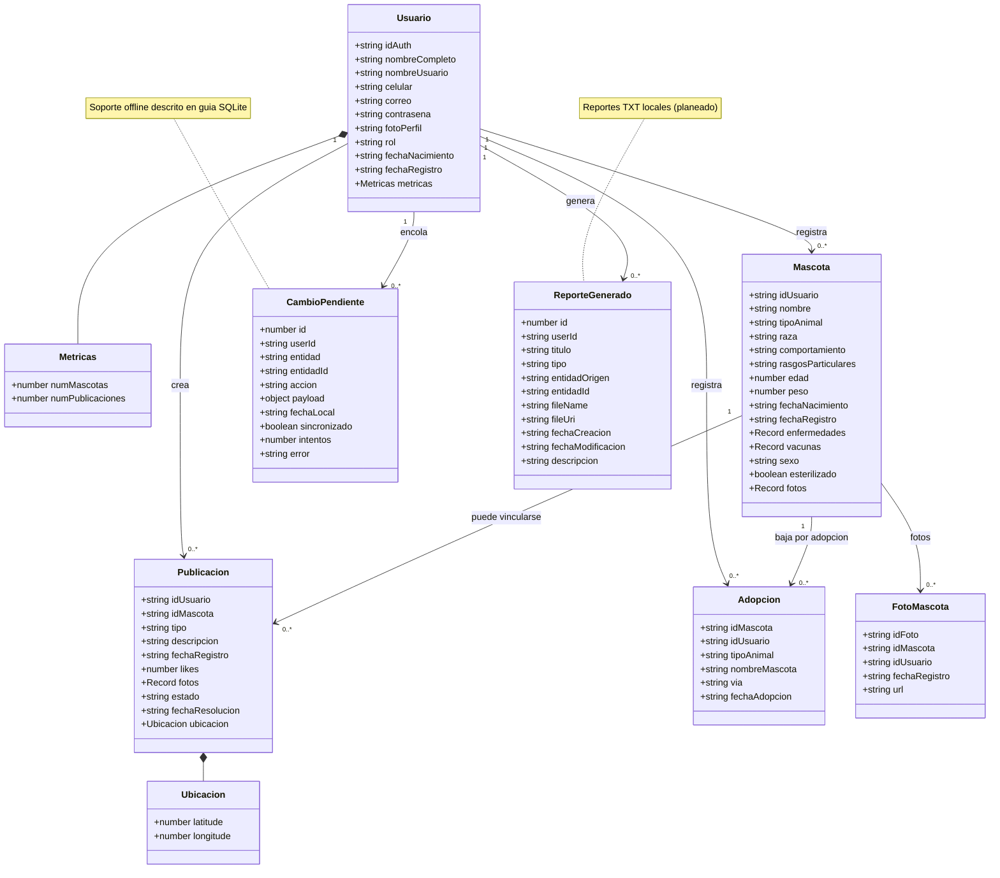
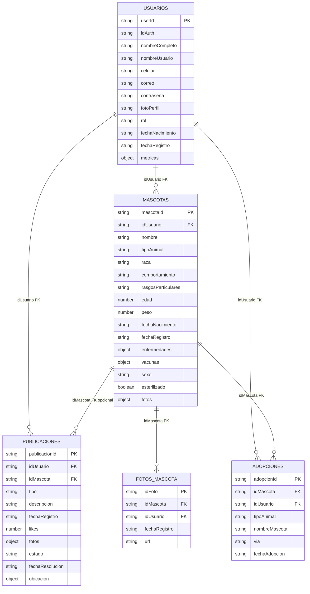
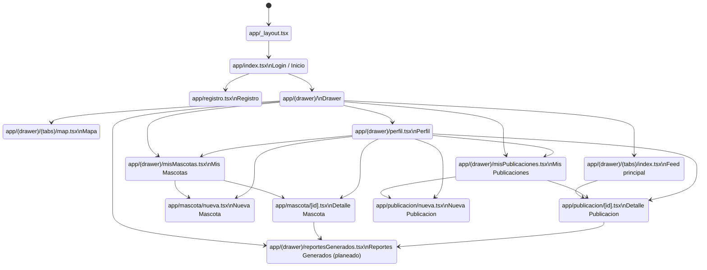

# Diagramas de diseño — RedPatitas

Este documento reúne únicamente los diagramas principales de diseño para entrega académica. Los diagramas se basan en `models/firebaseModels.ts`, la estructura real de `app/` con `expo-router`, y las guías de `.claude/command/` para SQLite offline y reportes TXT.

## 1. Diagrama de clases

El siguiente diagrama representa los modelos principales del dominio de RedPatitas. `Usuario`, `Mascota`, `Publicacion`, `Adopcion` y `FotoMascota` provienen de `models/firebaseModels.ts`. `CambioPendiente` y `ReporteGenerado` se incluyen por estar descritos en las guías de funcionalidad offline y reportes TXT.



## 2. Diagrama entidad-relación

### 2.1 Entidad-relación de Firebase

Este ERD representa los nodos principales de Firebase Realtime Database según `models/firebaseModels.ts`. Las llaves primarias corresponden a las claves generadas por Firebase en cada nodo.



### 2.2 Entidad-relación de SQLite offline

Este ERD resume las tablas locales propuestas/definidas para soporte offline y reportes TXT. Se basa en la guía offline SQLite, la guía de reportes TXT y el esquema local del proyecto.

```mermaid
erDiagram
  USUARIOS_LOCAL ||--o{ MASCOTAS_LOCAL : "idUsuario FK"
  USUARIOS_LOCAL ||--o{ PUBLICACIONES_LOCAL : "idUsuario FK"
  USUARIOS_LOCAL ||--o{ ADOPCIONES_LOCAL : "idUsuario FK"
  USUARIOS_LOCAL ||--|| ESTADISTICAS_LOCAL : "idUsuario PK FK"
  USUARIOS_LOCAL ||--o{ CAMBIOS_PENDIENTES : "userId FK"
  USUARIOS_LOCAL ||--|| SYNC_ESTADO : "idUsuario PK FK"
  USUARIOS_LOCAL ||--o{ REPORTES_GENERADOS_PLANEADO : "userId FK opcional"
  MASCOTAS_LOCAL ||--o{ PUBLICACIONES_LOCAL : "idMascota FK opcional"

  USUARIOS_LOCAL {
    string id PK
    string idAuth
    string nombreCompleto
    string nombreUsuario
    string correo
    string fotoPerfil
    string rol
    int numMascotas
    int numPublicaciones
    string datosJson
    int pendienteSync
  }

  MASCOTAS_LOCAL {
    string id PK
    string idUsuario FK
    string nombre
    string tipoAnimal
    string raza
    int edad
    float peso
    string enfermedadesJson
    string vacunasJson
    string fotosJson
    int pendienteSync
    int eliminadoLocal
    int creadoLocal
  }

  PUBLICACIONES_LOCAL {
    string id PK
    string idUsuario FK
    string idMascota FK
    string tipo
    string descripcion
    string fechaRegistro
    int likes
    string fotosJson
    string estado
    float latitude
    float longitude
    int pendienteSync
    int eliminadoLocal
    int creadoLocal
  }

  ADOPCIONES_LOCAL {
    string id PK
    string idMascota
    string idUsuario FK
    string tipoAnimal
    string nombreMascota
    string via
    string fechaAdopcion
    int pendienteSync
  }

  ESTADISTICAS_LOCAL {
    string idUsuario PK_FK
    int totalMascotas
    int totalPublicaciones
    int totalReportes
    int totalPerdidos
    int totalRecreacion
    int totalAdopciones
    string mascotasPorTipoJson
    string publicacionesPorPeriodoJson
    string adopcionesPorMesJson
  }

  CAMBIOS_PENDIENTES {
    int id PK
    string userId FK
    string entidad
    string entidadId
    string accion
    string payloadJson
    string fechaLocal
    int sincronizado
    int intentos
    string error
  }

  SYNC_ESTADO {
    string idUsuario PK_FK
    string ultimaCargaFirebase
    string ultimaSincronizacion
    int hayCambiosPendientes
    string ultimaConexionDetectada
  }

  REPORTES_GENERADOS_PLANEADO {
    int id PK
    string userId FK
    string titulo
    string tipo
    string entidadOrigen
    string entidadId
    string fileName
    string fileUri
    string fechaCreacion
    string fechaModificacion
  }
```

## 3. Diagrama de navegación de la app

El siguiente diagrama muestra la navegación principal basada en la estructura real de `app/` y `expo-router`. La pantalla `reportesGenerados.tsx` se marca como `(planeado)` por estar asociada a la guía de reportes TXT.


