# Diagramas RedPatitas

Documentacion tecnica de diagramas para RedPatitas, basada en `models/firebaseModels.ts`, `app/`, `database/`, `services/`, `hooks/`, `utils/` y las guias de `.claude/command/`.

Notas de lectura:

- Firebase Realtime Database es la fuente principal en linea.
- SQLite funciona como cache personal local y cola de sincronizacion.
- Los reportes `.txt` son locales y no se sincronizan con Firebase.
- Cuando una capacidad proviene de las guias y no esta completamente visible como flujo productivo, se marca como `(planeado)`.

## 1. Casos de uso

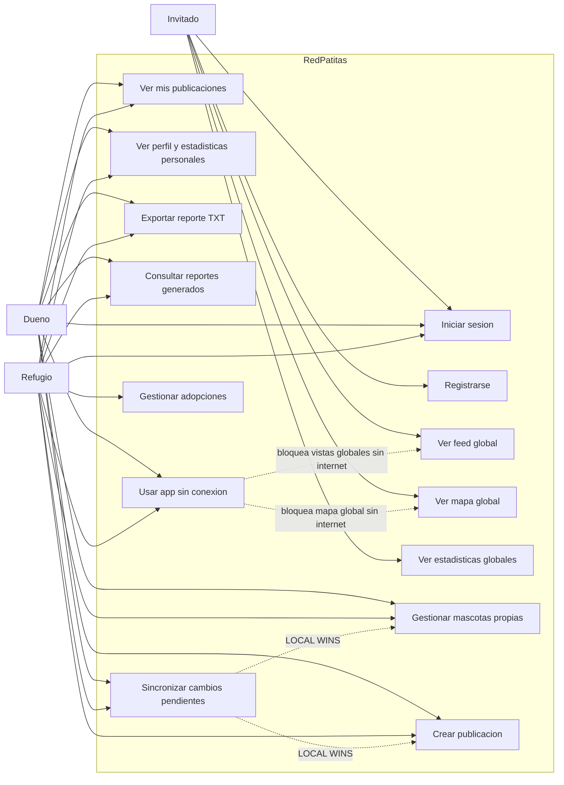

## 2. ERD de Firebase

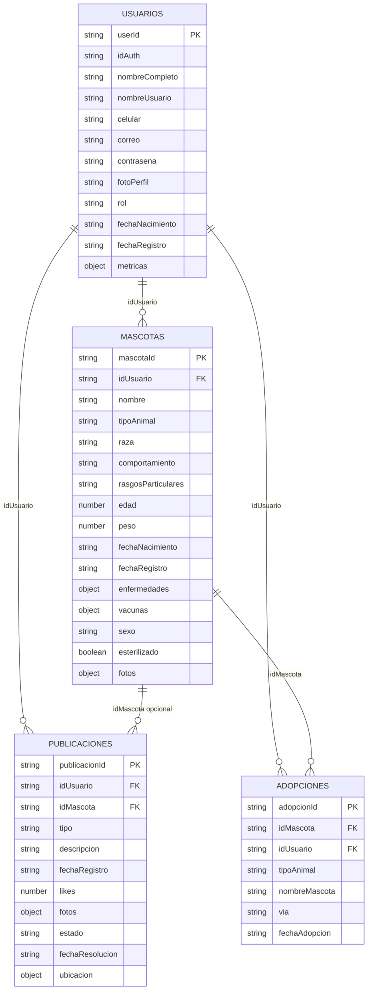

## 3. ERD de SQLite offline planeado

Este diagrama representa la estructura local definida en `database/schema.ts`. La guia la describe como planeada, pero el esquema ya existe en el proyecto.

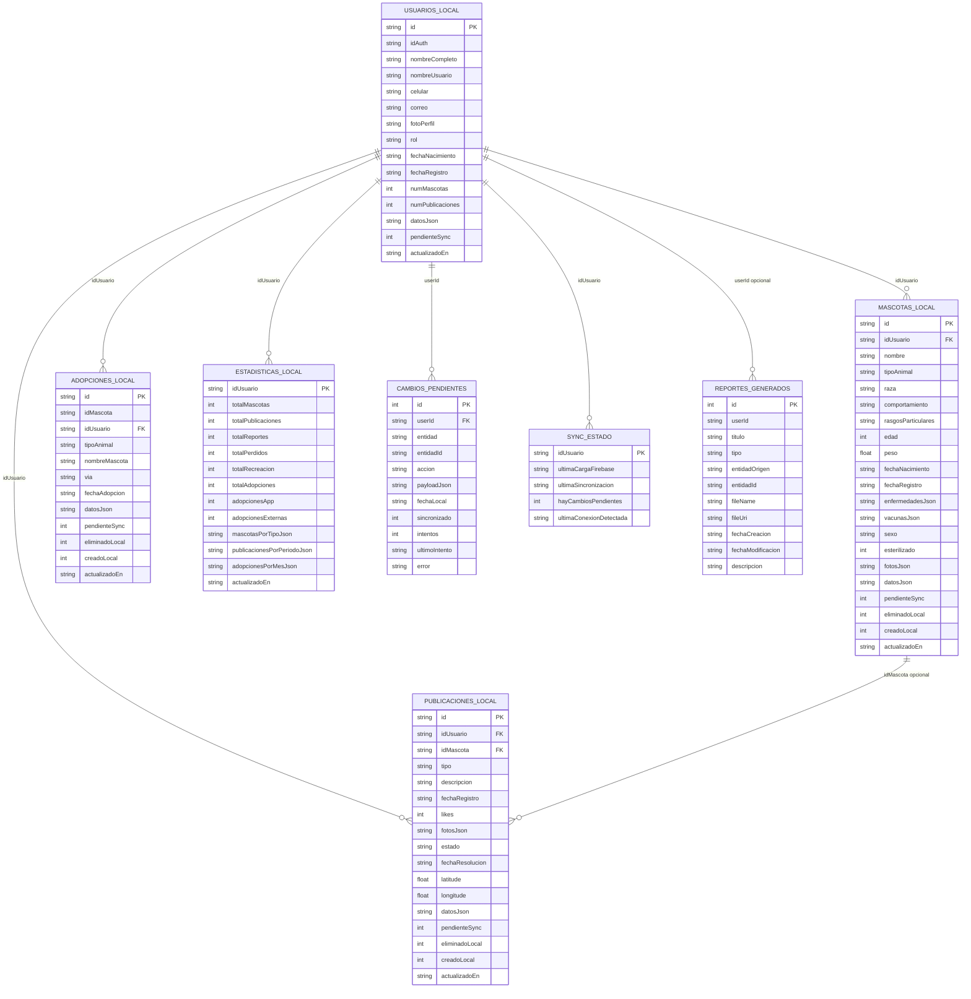

## 4. Clases y modelos principales

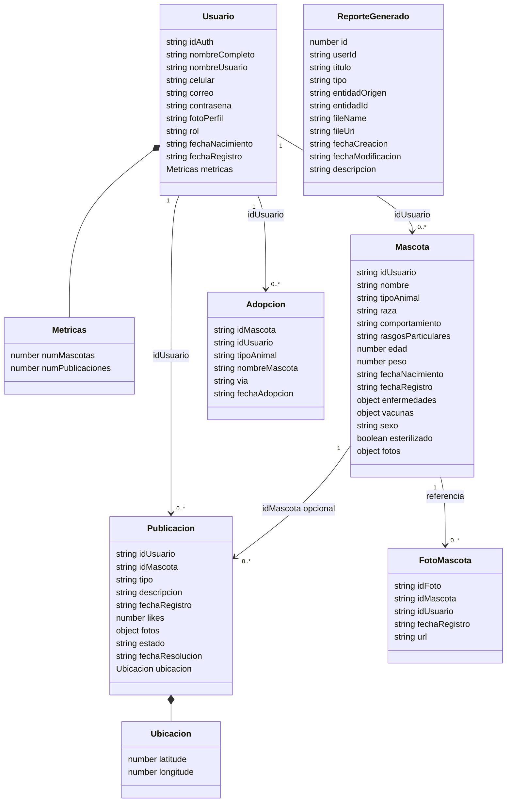

## 5. Arquitectura general

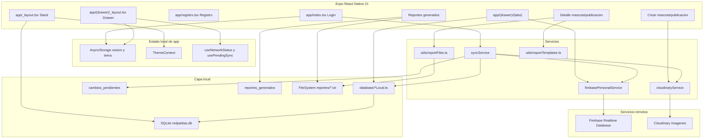

## 6. Navegacion de la app

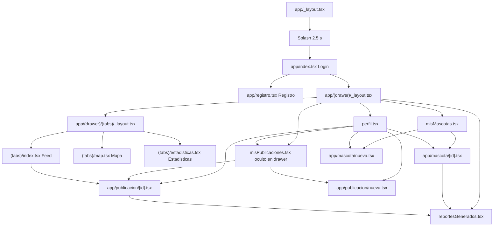

## 7. Secuencia de inicio de sesion y carga local

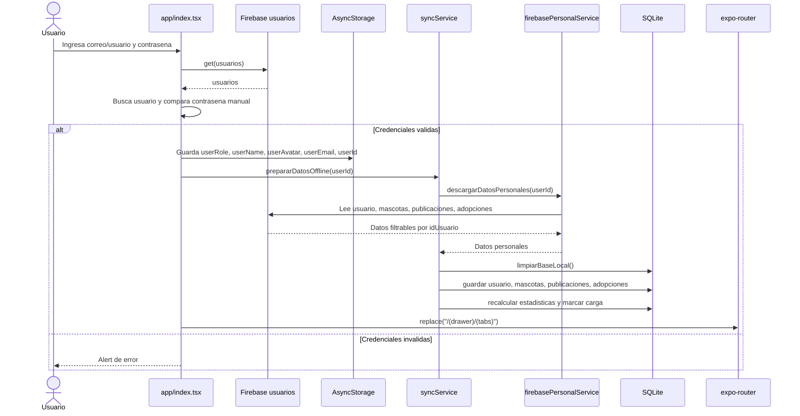

## 8. Secuencia de creacion offline

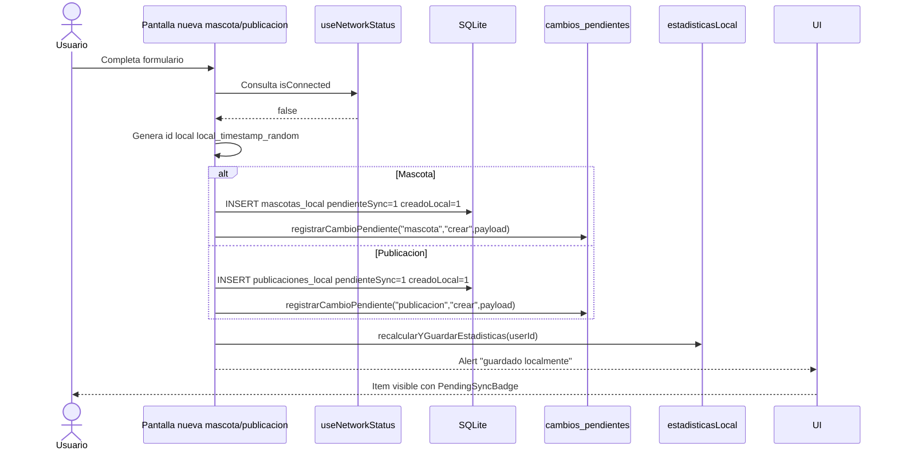

## 9. Secuencia de sincronizacion al recuperar internet

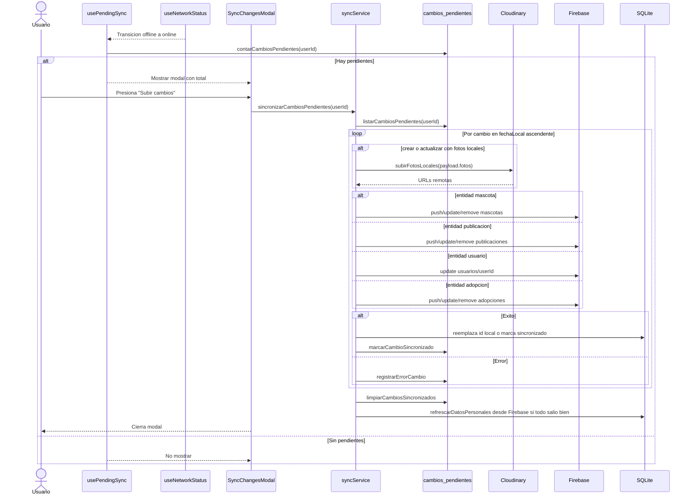

## 10. Secuencia de exportacion TXT

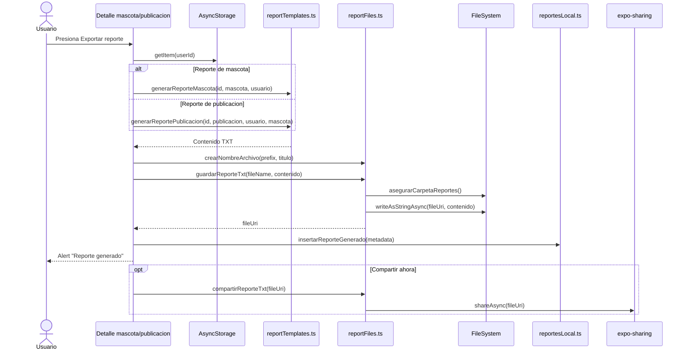

## 11. Flujo del modo offline

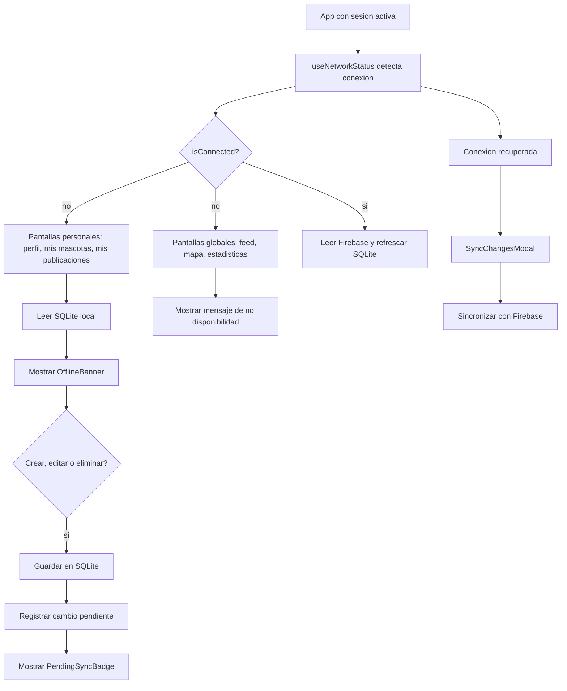

## 12. Componentes y modulos

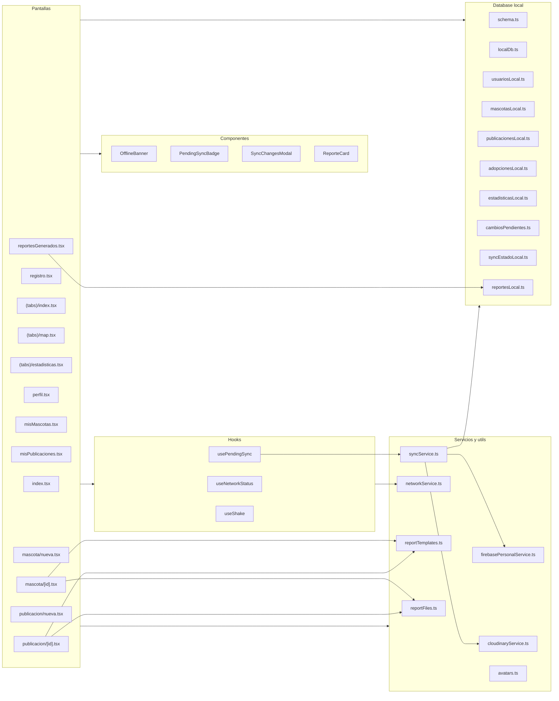

## 13. Estados de sincronizacion

Diagrama adicional generado a partir de la arquitectura offline.

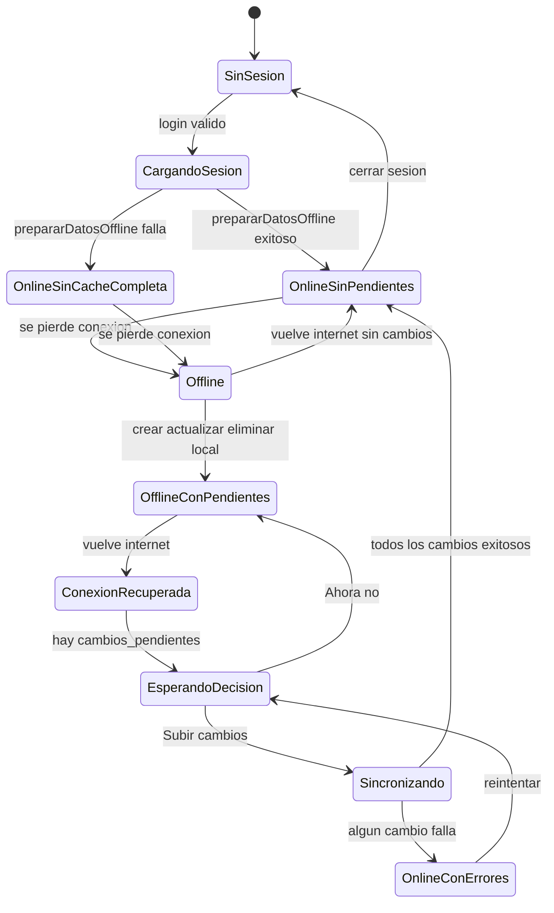

## 14. Flujo de reportes generados

Diagrama adicional porque el proyecto ya contiene la funcionalidad de reportes TXT y su pantalla en el Drawer.

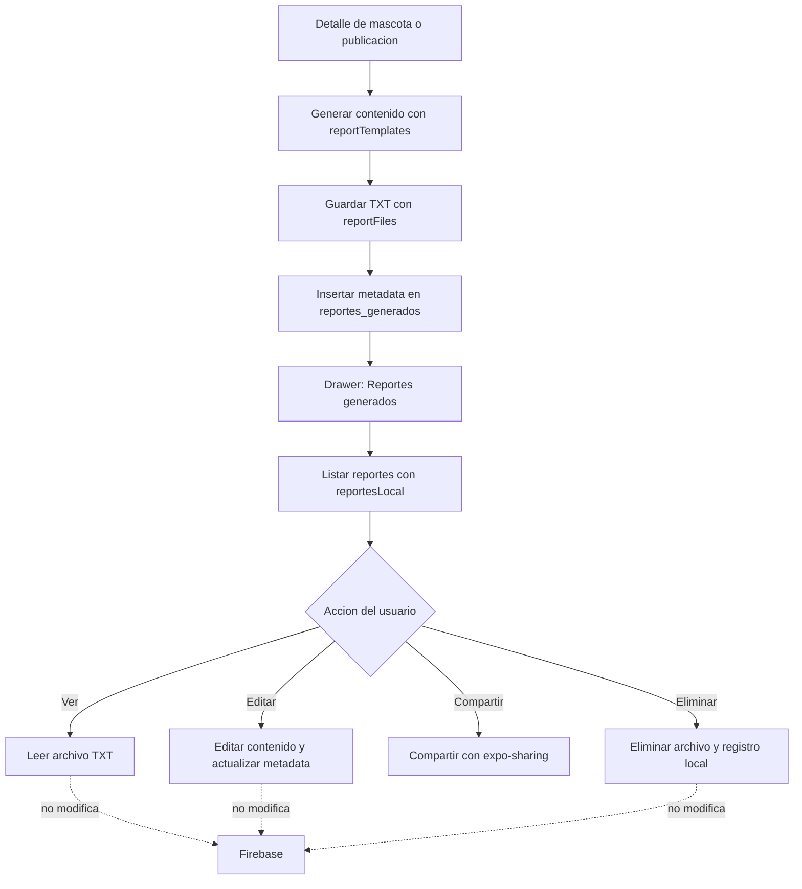

## 15. Lectura por pantalla segun conectividad

Diagrama adicional para resumir la politica de fuentes de datos.

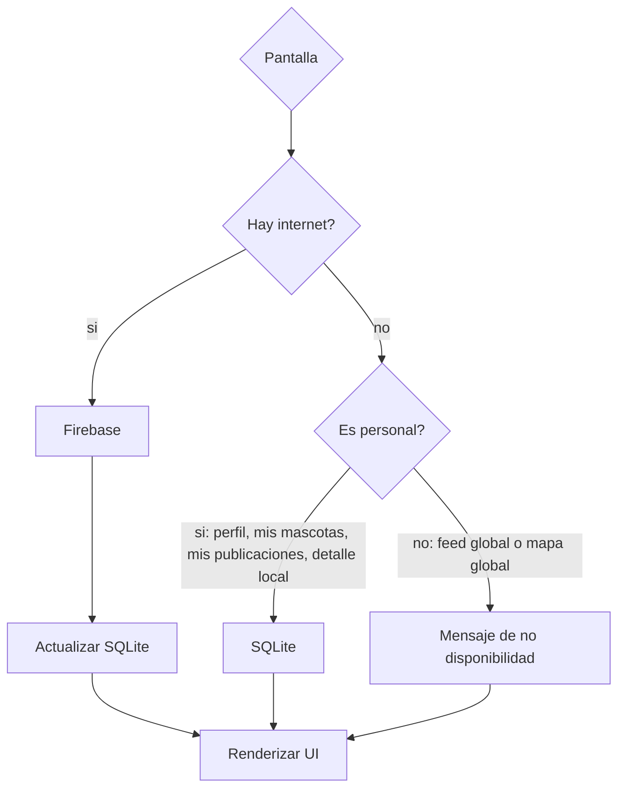

